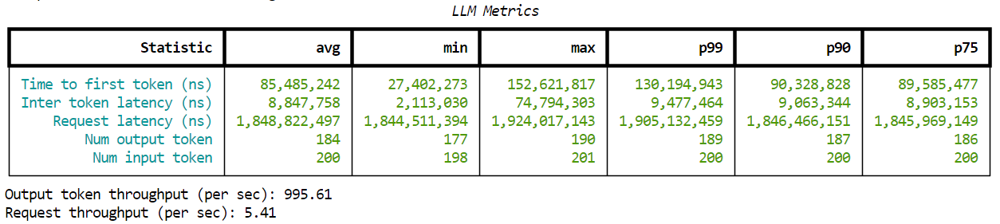

# Customer TCO Analysis

This repository can be shared with customers!<br>
It helps customers analyze and visualize the Total Cost of Ownership (TCO) for their GenAI workloads. It provides tools to:
1. Run performance benchmarks using NIMs and GenAI-Perf
2. Analyze latency and throughput data
3. Visualize results and calculate infrastructure costs

**Note:** GenAI-Perf can be used to benchmark any OpenAI-compatible inference server. For more information, please refer to the [GenAI-Perf documentation](https://docs.nvidia.com/nim/benchmarking/llm/latest/step-by-step.html).
## Prerequisites

Before running the benchmarks, ensure you have:

1. NVIDIA Container Runtime installed
   - Install from: https://docs.nvidia.com/datacenter/cloud-native/container-toolkit/install-guide.html
   - Verify with: `nvidia-smi`

2. Docker installed and configured
   - Follow: https://docs.docker.com/engine/install/

3. NGC API Key
   - Create an account at: https://ngc.nvidia.com/
   - Generate API key at: https://ngc.nvidia.com/setup/api-key

4. Sufficient GPU & Storage Space
   - Each NIM is optimized for a different list of GPUs and requires a different amount of Disk storage and GPU Memory. For a full list and specifications look [here](https://docs.nvidia.com/nim/large-language-models/latest/supported-models.html).

## Instructions

Follow these steps to run your benchmarks:

1. Configure environment variables in `common_env.sh`
2. Launch NIM container using `nim-docker-launch.sh`.
3. Run benchmarks using `genai-perf-docker-launch.sh`
4. Visualize the Benchmarking and Total Cost of Ownership data

For detailed benchmarking guidance, refer to [NIM for LLM Benchmarking Guide](https://docs.nvidia.com/nim/benchmarking/llm/latest/index.html).

### 1. Configure environment variables:
Environment variables to set in `common_env.sh` are:
* NIM_IMG_NAME - Which container image you want to run. Get the full list of NIM containers at [NGC Containers](https://catalog.ngc.nvidia.com/containers?filters=nvidia_nim%7CNVIDIA+NIM%7Cnimmcro_nvidia_nim&orderBy=weightPopularDESC&query=&page=&pageSize=)
* NIM_MODEL_PROFILE - Although you NIM can download the default, it's best to set this variable so that you can see which profile is running.
* LOCAL_NIM_CACHE - Where you want the downloaded NIM files to be downloaded to & loaded from on your machine. Default is set to `~/.cache/nim`<br>

### 2. Launch NIM container using `nim-docker-launch.sh`.
Running this script will launch the requested NIM.<br>
**Note**: The **first** time you run a specific NIM or profile, the container & model weights and necesary files will be downloaded from NGC. This may take a few mins.<br> Running the same NIM & Profile again will be fast.

### 3. Run benchmarks using `genai-perf-docker-launch.sh`
This shell script will download the GenAI-Perf docker container and run the `./sweep-genai-perf.sh` script inside it. <br>
Read more about GenAI-Perf and its optional parameters in the official [docs](https://docs.nvidia.com/deeplearning/triton-inference-server/user-guide/docs/perf_analyzer/genai-perf/README.html).<br>
The GenAI-Perf will output to your console output such like this:

We will visiualize all the different concurrency results in a graph. This will be in section 4.

### 4. Visualize the Benchmarking and Total Cost of Ownership data 
After collecting benchmark data:
1. Create Python virtual environment and install dependencies:
```
python -m venv venv
source venv/bin/activate
pip install -r requirements.txt
```
2. Open the [analysis notebook](analyze_latencies.ipynb) and [more analysis](more_performance_analysis.ipynb)
3. Update the cost parameters for your infrastructure in the 
4. Generate visualizations and TCO analysis

The notebook expects benchmark results in the following structure (unless you changed something, this will already be the case):
```
genai-perf-artifacts/
└── model-<model-name>/
    └── profile-<profile-name>/
        └── <timestamp>/
            └── concurrency-<N>/
                └── <benchmark_results>.json
```

For example:
```genai-perf-artifacts/model-meta-llama-3.1-8b-instruct/profile-tensorrt_llm-h100-fp8-tp1-throughput/2024-11-13_13.00.39/concurrency-5/2000_200_genai_perf.json```
We use a regex to parse some inputs from such path that you may need to update.